# Agentic Orchestration Layer Model
> **Dynamic Intelligence Middleware** vs. Static Data Pipelines

## The Core Concept: "Laying Pipes on the Fly"

In traditional software architecture, developers build **Static Middleware**. We explicitly define:
1.  "Fetch data from Endpoint A."
2.  "Transform it using Logic B."
3.  "Send it to Service C."

These "pipes" are laid hard and fast. If the data schema changes, or the business question evolves, the code breaks. You have to re-wire the connection.

**This project implements Agentic Orchestration.**

Here, **we do not pre-define the data flow.** Instead, we give an AI Orchestrator (Google Gemini 3 Pro) a set of **Capabilities (Tools)** and **Knowledge (Documentation)**.

When a request comes in, the AI **decides on the fly**:
1.  *What* data does it need? (It reads the DB Schema docs).
2.  *How* should I get it? (It constructs a custom SQL query).
3.  *How* should I process it? (It writes and executes a Python script in a secure sandbox).
4.  *How* should I present it? (It formats the final answer).

The AI is not just moving data; it is **effectively writing the integration code at runtime**, specifically tailored for that exact user request.

---

## Wie das System funktioniert (Einfache Erklärung)

Hier ist eine einfache Erklärung, wie dieses "Orchestrierungs-Layer" funktioniert – ohne Tech-Jargon.

Stell dir das System wie einen **intelligenten Projektmanager** vor, der Zugriff auf verschiedene Spezialisten (Tools) hat.

### Der Prozess in 4 Schritten:

1.  **Dein Auftrag (Der Input):**
    Du stellst eine Frage, z.B. *"Berechne die Umsatzsteuer für alle US-Kunden."*
    Das Frontend schickt diesen Text an das "Gehirn" (Gemini 3 Pro).

2.  **Das "Denken" (Die Orchestrierung):**
    Das Modell bekommt nicht nur deine Frage, sondern auch eine Liste von Werkzeugen, die es benutzen darf (eine Art Werkzeugkoffer).
    Es überlegt dann selbstständig:
    > *"Okay, ich brauche Daten. Ich kann nicht raten. Ich habe ein Tool namens `run_sql`, um die Datenbank abzufragen. Das benutze ich jetzt."*

3.  **Die Aktion (Tool Use):**
    *   Das Modell generiert einen Befehl: `run_sql(query="SELECT ...")`.
    *   Mein Code fängt diesen Befehl ab, führt ihn auf der echten Datenbank aus und bekommt das Ergebnis (die Tabelle mit den Zahlen).
    *   **Wichtig:** Dieses Ergebnis schicke ich *zurück* an das Modell. Es "liest" also die Datenbank-Antwort.

4.  **Die Synthese (Business Logic):**
    Das Modell sieht jetzt die Daten. Es merkt vielleicht: *"Ah, ich habe die Umsätze, aber ich muss noch die Steuer draufrechnen."*
    Es entscheidet wieder: *"Dafür bin ich im Kopfrechnen zu schlecht. Ich schreibe lieber ein Python-Skript."*
    *   Es generiert Python-Code.
    *   Mein System führt den Code aus (`run_python`) und gibt das Rechenergebnis zurück.
    *   Erst wenn das Modell zufrieden ist, formuliert es die endgültige Antwort für dich.

### Warum das "Agentic" ist?
Ein klassischer Chatbot rät oder nutzt nur Wissen aus seinem Training. Dieses System **handelt**. Es:
*   **Plant** (Was muss ich tun?)
*   **Benutzt Werkzeuge** (SQL, Python, Files lesen)
*   **Korrigiert sich** (Wenn ein SQL-Fehler kommt, sieht es den Fehler und probiert es anders)

---

## The Technical Moat (Why this is different)

This architecture separates itself from standard "Chatbots" or "RAG" wrappers through three key mechanisms:

### 1. System 2 Reasoning Loop (Cognitive Layer)
Most AI apps are "System 1" (Impulsive). They answer immediately and hallucinate.
This system leverages **Gemini 3's Native Thinking** (`ThinkingLevel.HIGH`):
- **Deep Reasoning**: The model enters an encrypted thinking process (`thoughtSignature`) to plan before it speaks.
- **Checks**: Validates against security constraints globally.
- **Verifies**: Writes mandatory Python assertions to prove its own results.

### 2. Runtime Code Generation (Capability Layer)
We do not use standard RAG (Retrieval Augmented Generation). We use **CAG (Code Augmented Generation)**.
- **Competitors**: "Here is a text summary of your data." (Probabilistic/Fuzzy).
- **This Agent**: "I wrote a Python script to calculate this exactly. Here is the code and the verified result." (Deterministic/Precise).

### 3. The "Glass Box" Trust Engine
By visualizing the "Stream of Consciousness" (Reasoning -> Tool -> Result), we solve the "Black Box" trust problem. The user sees exactly *how* the answer was derived.

---

## Architecture Overview

This system separates **Cognition** (Thinking/Planning) from **Computation** (Doing/Calculating).

### 1. The Orchestrator (Google Gemini 3 Pro)
The "Brain". It holds no hardcoded logic for business rules. Instead, it is instructed to:
- **Read Documentation First**: It looks at `knowledge/` to understand the database schema and business rules.
- **Delegate Math**: It is forbidden from doing math itself. It must write Python code to ensure accuracy.
- **Plan Dynamically**: It constructs multi-step workflows (e.g., "Join these 3 tables, then calculate tax") based on the specific question.

### 2. Memory (Supabase / PostgreSQL)
The "Source of Truth".
- We do not write custom API endpoints for every query.
- We provide a single **Generic SQL Tool (`run_readonly_sql`)**.
- The Agent learns the schema from `database_schema.md` and writes valid SQL to answer *any* question.

### 3. Computation (E2B Sandbox)
The "Calculator".
- LLMs are bad at math and logic execution.
- We provide a **Python Sandbox Tool (`run_python`)**.
- The Agent sends code to this secure environment to perform aggregations, tax calculations, and data processing.

### 4. Knowledge Base (`/knowledge`)
The "Instructions".
- If business rules change (e.g., Tax Rate goes from 5% to 10%), we **do not change code**.
- We simply update `business_rules.md`. The Agent reads the new rule next time it runs and adapts immediately.

---

## Technical Stack

- **Frontend**: Next.js 14, Tailwind CSS, Lucide React (Streaming Chat UI).
- **AI Model**: Google Gemini 3 Pro (via `@google/generative-ai`).
- **Database**: Supabase (PostgreSQL) with `pg_trgm` for fuzzy search.
- **Sandbox**: E2B Code Interpreter (`@e2b/code-interpreter`).
- **Backend Logic**: Next.js API Routes (Serverless).

## Use Case Example

**User**: *"Calculate total revenue for 'Stark Industries' including tax."*

**Static Approach**:
- Developer writes `getRevenue(clientName)` function.
- Developer hardcodes `SELECT * FROM invoices ...`.
- Developer hardcodes `total = sum * 1.0`.
- *Result*: Works only for revenue. Fails if user asks for "Average revenue per project".

**Agentic Approach**:
1.  **Read**: Agent reads `database_schema.md` -> sees `clients`, `projects`, `work_logs`.
2.  **Read**: Agent reads `business_rules.md` -> sees "US Tax Rate is 0%".
3.  **Plan**: "I need to join these tables and filter by 'Stark Industries'."
4.  **Query**: Agent writes `SELECT ... JOIN ... WHERE name ILIKE '%Stark%'`.
5.  **Compute**: Agent writes Python: `total = sum(hours * rate); tax = total * 0.0; print(total + tax)`.
6.  **Result**: $7,750.00.

If the user then asks *"What is the average revenue?"*, the Agent simply generates a **new** SQL query and a **new** Python script. Zero code changes required.

---

## High-Value Use Cases

This architecture is optimized for **High-Complexity, High-Variance Data Environments**:

### 1. Ad-Hoc Business Intelligence
- **Scenario**: CFO needs a specific breakdown (e.g., "Revenue by Industry for Q3") that isn't on the dashboard.
- **Solution**: The Agent acts as a real-time Data Analyst, writing the SQL/Python on demand. Time-to-insight drops from weeks to seconds.

### 2. Supply Chain "War Room"
- **Scenario**: "A ship is stuck in Suez. Which orders are affected and what is the financial impact?"
- **Solution**: The Agent dynamically joins `Shipments`, `Orders`, and `Inventory` tables to calculate the precise impact, handling a query that no static dashboard was designed for.

### 3. Automated Compliance & Auditing
- **Scenario**: "Audit every transaction over $10k against the new 2025 AML rules."
- **Solution**: Update `business_rules.md` with the new regulation. The Agent immediately "knows" how to apply the new rules to the data without a code refactor.

---

## The Paradigm Shift: From Personas to Environments

Most people think an AI Agent is a "person" (a persona). We treat an Agent as a **State Machine + Contextual Environment**.

By building an "Environment" rather than a "Chatbot," we provide the AI with three things it lacks out-of-the-box:

### 1. The "Physical" Law (Tools & Sandboxes)
An LLM in a vacuum can only talk. By giving it an Environment (E2B + SQL), we give it "physics."
*   In the real world, if you drop a ball, it falls.
*   In this environment, if the AI writes a syntax error, the environment "pushes back" with an error message.
*   **Result**: The AI learns the limits of its world and adjusts. It’s no longer "hallucinating" in a void; it’s "interacting" with a system.

### 2. The "Constitution" (Rules & Schema)
The `business_rules.md` and `database_schema.md` act as the Geography of the environment.
*   We don't tell the AI *what* to think; we tell it *where the walls are*.
*   "You can't calculate VAT for the US." → That is a wall.
*   "The revenue is in the orders table, not sales." → That is a path.

### Why "Environments" scale better than "Agents"
If you build "Agents," you have to manage a dozen different personalities. If you build "Environments," you only have to manage the Data and the Rules.
*   **Old Way**: Build a "Marketing Agent", then a "Sales Agent".
*   **Our Way**: Drop `marketing_data.sql` and `branding_rules.md` into the Environment. The Brain (Gemini) stays the same, but the "Contextual World" changes.

### 4. The "Multi-Agent" Context Tax
In a multi-agent system, when Agent A (The Researcher) hands off a "summary" to Agent B (The Analyst), two things happen:
1.  **Loss of Nuance**: Agent A decides what is important. If Agent A misses a "small" detail in a SQL schema that actually changes the math, Agent B never sees it. The context is "compressed" and therefore "corrupted."
2.  **The "Telephone Game" Effect**: By the time you get to the 4th agent, the original user intent has been filtered through three different "personalities."

**Our Single Brain Approach**: Gemini 3 Pro has a 2-million token context window. We don't need to swap brains. We keep the raw SQL schema, the business rules, the error logs, and the Python output all in one active "working memory." This enables **Coherent Reasoning**.

### 5. "Thinking" as Internal Native Context
In this system, we use **Gemini 3 Native Entrypted Thinking**.
*   **Encrypted Loop**: The model produces a `thoughtSignature` with every response.
*   **Persistence**: We capture this token and feed it back into the next turn.
*   **Result**: The model maintains a massive, invisible "chain of thought" across the entire conversation, ensuring its next action is grounded in deep reasoning, even if you can't see the text yourself.

### 6. The "Recursive Memory" (Self-Correcting Documentation)
Right now, the agent reads `business_rules.md` and `database_schema.md`. But true intelligence writes its own rules.
*   **The Idea**: Every time the agent hits an error and fixes it, it writes a "Learned Lesson" into `agent_memory.md`.
*   **The Leverage**: Next time, it reads its own journal and avoids the mistake. This builds a system that compounds its own IQ over time without human intervention.

### 7. The "Supervisor Layer" (The Logic Check)
We have added a mandatory validation step to prevent "Math Hallucinations".
*   **The Constitution**: `safety_policy.md` defines the laws of physics for the code (e.g., "Must use Assertions", "No Infinite Loops").
*   **The Hard Verifier**: The `run_python` tool *rejects* any code that lacks `assert` statements. The Agent *must* write tests for its own code vs the Safety Policy.
*   **The Logic Check Loop**: After every tool execution, the Agent performs a mandatory `<reflection>`: *"Does this result make sense?"* (e.g., "Can Revenue be negative?"). If No, it self-corrects before you ever see the bad number.

### 8. The "Consensus & Verification Loop" (Triangulation)
We have moved from a "Fire-and-Forget" architecture to a **"Triangulation"** architecture for all quantitative questions.
*   **The Problem**: LLMs are probabilistic. They can "hallucinate" a number.
*   **The Solution**: We enforce a **Triangulation Protocol** ($V_{truth}$) using the `verify_integrity` tool.
*   **How it works**:
    1.  **Path A (SQL)**: The Agent writes a SQL query to calculate the metric directly in the Database.
    2.  **Path B (Python)**: The Agent fetches the raw data and recalculates the same metric using Pandas in a sandbox.
    3.  **The Consensus**: The system compares the two scalars.
        *   If `Delta < 1%`: **VERIFIED**. The result is shown to the user.
        *   If `Delta > 1%`: **FAILED**. The system rejects the answer and triggers a self-correction loop.
*   **UI Feedback**: You will see a purple **"CONSENSUS LOOP"** badge and a "Verifying Logic..." state while this rigorous double-check is happening.

---

---

## Self-Healing & "Anti-Fragility"

One of the most powerful features of this architecture is its ability to recover from errors without human intervention. The agent uses a **Feedback Loop** to correct itself.

### The "Try-Error-Retry" Loop
Since the agent constructs code at runtime, sometimes it breaks rules (e.g., trying to use forbidden SQL syntax).

**Real-World Example (from this project):**
1.  **Action**: The Agent tried to use a SQL **CTE** (`WITH ... AS`) to calculate benchmarks.
2.  **Constraint**: The `run_readonly_sql` tool is strictly configured to only accept simple `SELECT` statements for security.
3.  **Error**: The system returned: `Security Error: Only SELECT queries are allowed.`
4.  **Self-Correction**:
    - The Agent did **not** give up.
    - It analyzed the error message within the same context window.
    - It **reasoned**: *"CTEs are forbidden. I must rewrite this logic using Subqueries instead."*
5.  **Result**: It generated a valid nested `SELECT` query and successfully got the data.

## System 3 Architecture Updates (New)

We have upgraded the core loop to resemble "System 2" reasoning (Daniel Kahneman), making the AI more deliberate and transparent.

### Architecture Overview

```mermaid
graph TD
    %% --- THEME & STYLING ---
    classDef user fill:#2563eb,stroke:#1e40af,stroke-width:2px,color:white;
    classDef ai fill:#f3e8ff,stroke:#7e22ce,stroke-width:2px,color:#4c1d95;
    classDef db fill:#f1f5f9,stroke:#64748b,stroke-width:2px,color:#0f172a;
    classDef logic fill:#ecfdf5,stroke:#059669,stroke-width:2px,color:#064e3b;
    classDef sandbox fill:#fff7ed,stroke:#ea580c,stroke-width:2px,color:#7c2d12;
    classDef error fill:#fef2f2,stroke:#dc2626,stroke-width:2px,color:#991b1b,stroke-dasharray: 5 5;
    
    %% Minimalistic Zone Styling
    style Cognitive fill:#fafafa,stroke:#e5e7eb,stroke-width:1px,rx:10,ry:10
    style Supervisor fill:#fafafa,stroke:#e5e7eb,stroke-width:1px,rx:10,ry:10
    style Triangulation fill:#fafafa,stroke:#e5e7eb,stroke-width:1px,rx:10,ry:10
    style PathA fill:#ffffff,stroke:#cbd5e1,stroke-width:1px,stroke-dasharray: 5 5
    style PathB fill:#ffffff,stroke:#cbd5e1,stroke-width:1px,stroke-dasharray: 5 5

    %% --- TOP LAYER: INPUTS & CONTEXT ---
    %% We group these loosely at the top to avoid the "Side Block" issue
    User([👤 User Request]):::user
    Schema[("Database Map")]:::db
    Rules[("Constitution")]:::db
    Lessons[("Learned Memory")]:::db

    %% --- MIDDLE LAYER: PROCESSING ---
    subgraph Cognitive ["🧠 System 2 Cognitive Layer"]
        Orchestrator[/"✨ AI Orchestrator<br/>(Gemini 3 Pro)"/]:::ai
        Thinking{{"Thinking Phase<br/>Plan & Hypothesize"}}:::logic
    end

    subgraph Supervisor ["🛡️ Supervisor Layer"]
        Policy["Safety Policy"]:::logic
        Assert{"Has Assertions?"}:::logic
    end

    subgraph Triangulation ["⚖️ Triangulation Protocol"]
        direction TB
        
        subgraph PathA ["Path A: Source"]
            SQLTool[("SQL Execution")]:::db
            ResultA[/Scalar A/]:::db
        end

        subgraph PathB ["Path B: Calc"]
            PyTool["Python Sandbox"]:::sandbox
            ResultB[/Scalar B/]:::sandbox
        end
        
        Compare{"Consensus Gate<br/>(Delta < 1%)"}:::logic
    end

    Reflection{"Reflection Loop"}:::ai
    Output([🚀 Render Dashboard]):::user
    
    %% Error Handling
    Error("⚠️ Consensus Fail"):::error
    WriteMem("📝 Write Lesson"):::sandbox

    %% --- CONNECTIONS ---
    
    %% 1. Top Down Flow
    User --> Orchestrator
    Schema & Rules & Lessons -.-> Orchestrator
    
    %% 2. Cognition
    Orchestrator --> Thinking
    Thinking --> Policy
    Policy --> Assert
    
    %% 3. Safety Split
    Assert -- "❌ Unsafe" --> Error
    Assert -- "✅ Safe" --> SQLTool & PyTool
    
    %% 4. Execution
    SQLTool --> ResultA
    PyTool --> ResultB
    ResultA & ResultB --> Compare
    
    %% 5. Decision
    Compare -- "Mismatch" --> Error
    Compare -- "Verified" --> Reflection
    
    Reflection -- "Illogical" --> Error
    Reflection -- "Sound" --> Output
    
    %% 6. Self-Healing Loop
    Error --> WriteMem
    WriteMem -.-> Lessons
    WriteMem -.-> Orchestrator

    %% Link Styling
    linkStyle default stroke:#94a3b8,stroke-width:2px;
```

### 1. Native Thinking (Encrypted Reasoning)
The agent no longer just "replies." It uses **ThinkingLevel.HIGH**:
- **Native Power**: We trade visible text traces for the raw power of Gemini 3's native reasoning engine.
- **Implicit Intelligence**: The model simulates potential paths, checks for traps, and validates its plan internally.

**UI**: Since thoughts are encrypted, we visualize the **Actions** that result from them.

### 2. "Glass Box" Visualization
We make the invisible visible through **Active Tooling**:
1.  **Knowledge Access**: You see a "KNOWLEDGE ACCESS" card when the agent checks the rules.
2.  **Tool Cards**: Every SQL query and Python script is rendered as a distinct card.
3.  **Result**: You see the *inputs* (arguments) and *outputs* (results) of the agent's thinking.

### 2. Chronological "Stream of Consciousness"
We refactored the rendering engine to be strictly chronological.
- **Old Way**: Thoughts bucketed at the top, tools in the middle, text at the bottom.
- **New Way**: A linear timeline.
  1. `Thinking: "I need to check schema"`
  2. `Tool: Read Database Schema`
  3. `Thinking: "Okay, table name is 'clients'. Now I query."`
  4. `Tool: Run SQL`
  5. `Text: "Here is the report..."`
  
This allows users to follow the **exact sequence of cause and effect**.

### 3. Silent Execution & "Zero-Gap" Feedback
- **Silent Execution**: The agent is forbidden from narrating its plan in the text channel ("I will now do X..."). All planning happens in `<thinking>` blocks. The text channel is reserved Key Results and Executive Summaries.
- **Streaming Feedback**: To prevent the "Uncanny Valley" of silence between Thinking and Output, we implemented a **Persistent Streaming Indicator** that displays "Executing..." or "Generating..." to confirm the agent is working in the background.
